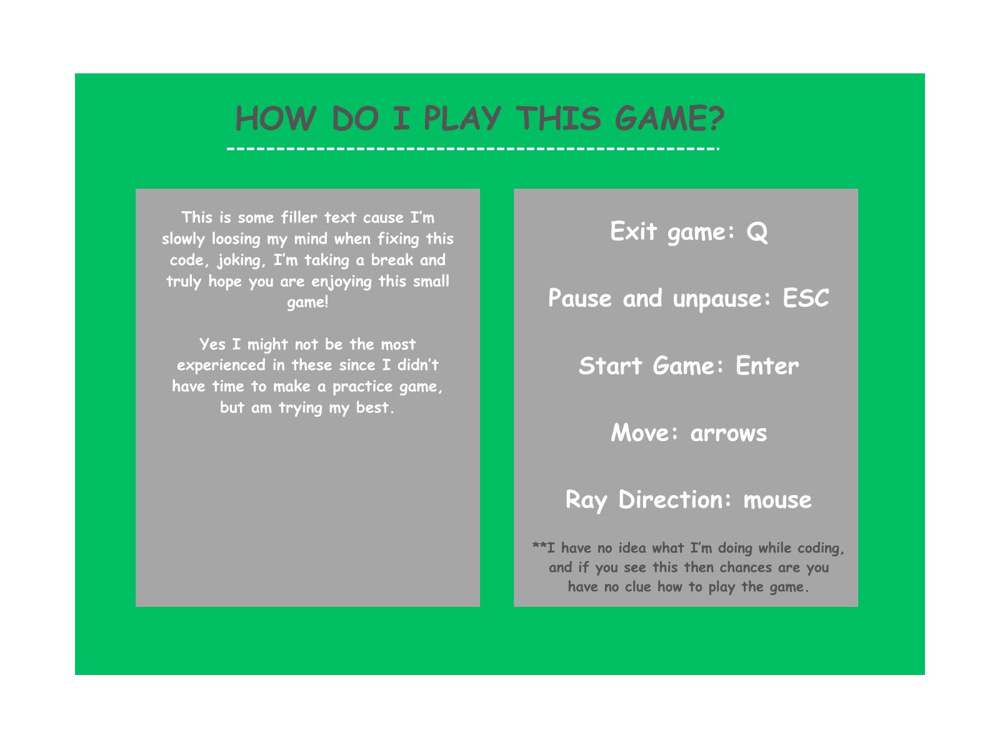

# supercell_coding_challenge

## How to play the game:
There are instructions everywhere, just start it and you'll find them. However, if you can't be bothered to then here:



```NOTE: ray direction is not accoridng to the mouse, I didn't have time to finish that part in the code```


## Ideas (do as much as you have time for):
- [ ] fix things
  - [x] ray shooting bug
  - [x] death level bug
  - [x] fix game playability
    - [x] delay added
    - [x] pausing key added
    - [x] starting key added
    - [ ] keep player within the window
    - [x] FIX pause bug (aka slowmotion mode)
  - [ ] fix ray turning feature
  - [ ] ~~movement bug~~

- [ ] add instruction screen
  - [x] move using arrows
  - [x] shoot ray using space (change this to right click)
  - [ ] change ray dir using mouse movement
- [x] add start screen
  - [x] add a key to press to start the game, if first level after launch then give instructions after
- [x] add end screen
  - [x] death screen
  - [ ] victory screen (after every level), add an option to leave the game or continue
- [x] add pause screen
- [ ] add special skills and cooldown to them (put that to left click)
- [ ] add new enemies
  - [ ] differnet colored ones, bigger, faster etc
- [ ] add different levels


## Notes and final thoughs:

> Next I would have tackled rotating the ray a full 360 around the player. I managed to add the rotation but not connect it to player movement, after that I would have just needed to figure out how to draw the ray / weapon on an angle.
>
> A nice addition would have also been adding levels (different background, enemies, adding obsticles, etc),give it a visual timer and add random collectables, which would have all given the game an actual goal to it!


> Overall I loved the challenge this game me and it was a refreshing change to my day, reminded kinda of the piscine! I learned so much and feel proud of how far I got even if I did have too ambitious goals / ideas, my perfectionist brain just kept on finding more and more small bugs which I would've spent the whole day fixing. 

> 